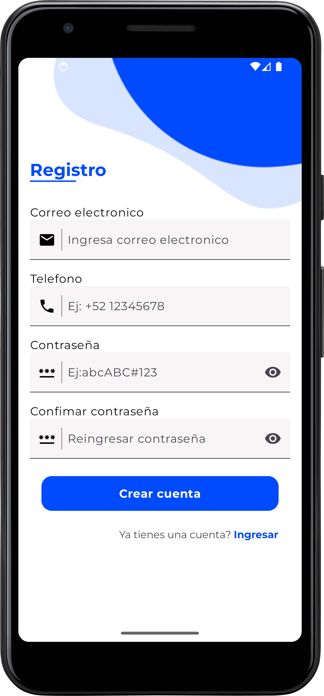
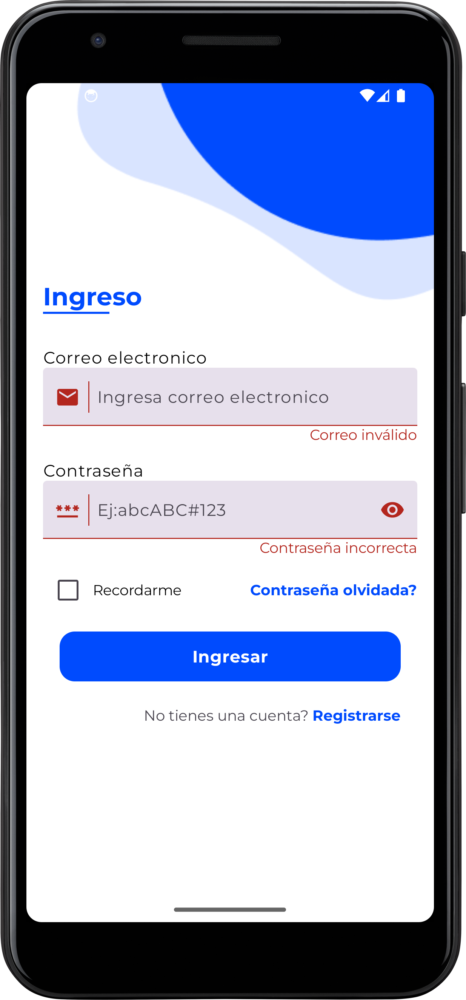
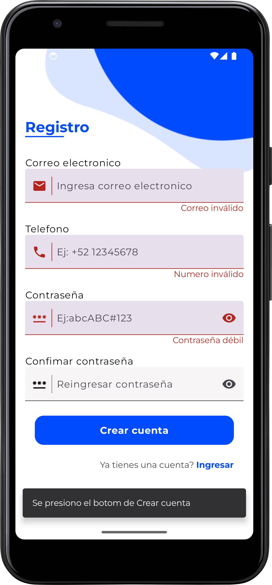

# AuthUiCompose

## Requisitos

- Android Studio Koala
- Gradle Version 8.7
- Kotlin 2.0.0.

## Descripcion del proyecto

Este proyecto se centra en la creación de pantallas de inicio de sesión y registro utilizando Jetpack Compose y Kotlin. 
Las pantallas están diseñadas para simular el proceso de inicio de sesión y registro, permitiendo la visualización de errores 
y la navegación correspondiente. La pantalla de inicio de sesión permite a los usuarios ingresar sus credenciales y verificar 
la respuesta de la interfaz ante posibles errores. De manera similar, la pantalla de registro incluye navegación y muestra errores 
potenciales en la UI para asegurar una experiencia de usuario fluida.

## Tecnologías y Herramientas Utilizadas
-Jetpack Compose: Para la creación de interfaces de usuario modernas y reactivas.
- Hilt: Para la inyección de dependencias, simplificando la gestión de componentes.
- NavigationCompose: Para la navegación entre pantallas utilizando Jetpack Compose.
- Material Design: Para garantizar una interfaz de usuario intuitiva y consistente.

## Estructura del proyecto
-core: Modulo que contiene funcionalidades compartidas entre diferentes módulos de la aplicación.
    -presentation: 
        -designsystem: Contiene los componentes composables que se reutilizaran en toda la pantalla y el diseño.
        -ui: Contiene funciones o utilidades para ui
-authentication: Modulo que contiene todas las pantallas relacionadas a la autenticacion
    -domain: Contiene los validadores para los campos de texto
navigation: Modulo que contiene toda la navegacion de pantallas.
    -util: Utilidades extras para la navegacion(Transiciones, funciones de extension)

## Pantallas

 

## Pantallas con errores

 

##Video de ejecucion de App

https://github.com/EliasMP07/AuthUI-KotlinCompose/assets/video_demo